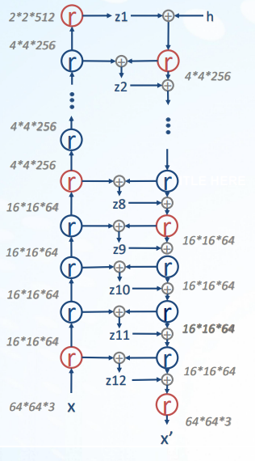

# Implement Multi-Scale group on Deep Hierarchical VAE & Analyze different architecture

## Abstract

By reading the paper <NVAE: A Deep Hierarchical Variational Autoencoder>,
we start to aim at

1.Designing a lightweight Hierarchical VAE model to approximate and reproduce
the result on datasets with different complexity, including CelebA(One species)
and ImageNet(Various Multiple species).

2.Implementing another improved Multi-Scale group model, which is
partitioned into 12 disjoint group of latent variables and three different scale to
achieve higher score on both dataset.

3.Futhermore, investigating Variable Control, that is, how the latent variable’s
each dimension affect the output image’s charactxeristic.

## Archicture

The red circle in encoder is residual block that reduce the dimension in picture.

The red circle in decoder is residual block that upsampling the dimension.
