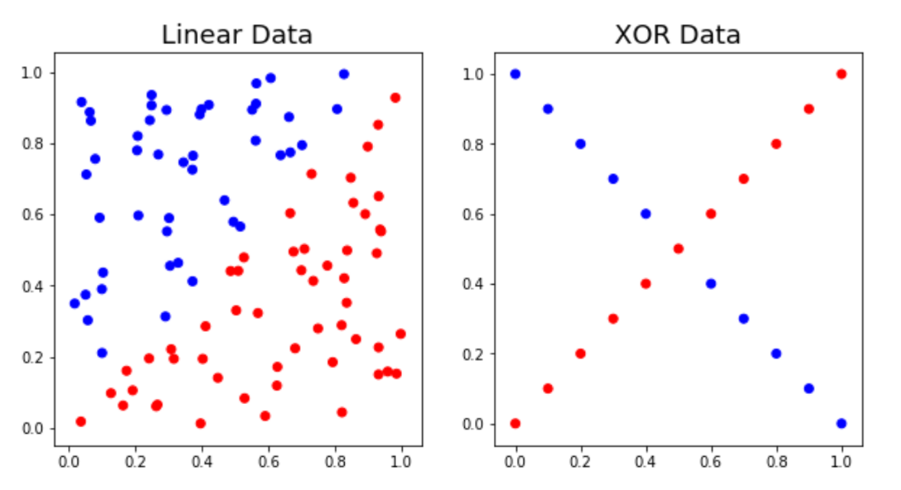
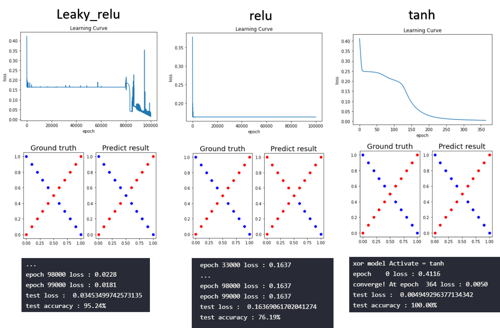
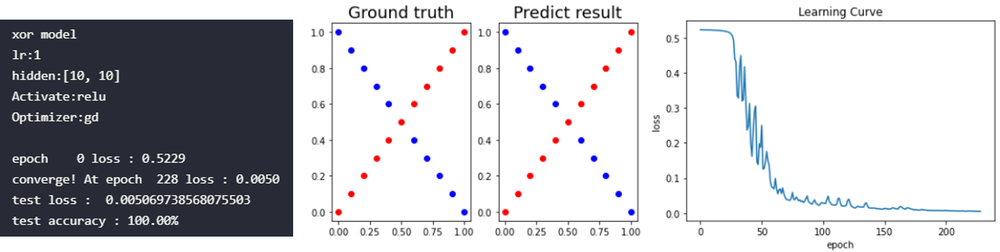

# Lab1

## 1. Introduction
### 1.1 Requirements

   1. Implement simple neural networks with two hidden layers.
   2. You must use backpropagation in this neural network and can only use Numpy and other python standard libraries to implement.
   3. Plot your comparison figure that show the predicted results and the ground-truth.


### 1.3 Parameter

	1. x1,x2∶ NN inputs
	2. X ∶ [x1,x2]
	3. predict ∶ NN outputs
	4. y ∶ ground truth
	5. L(θ) ∶ loss function (MSE(θ))
	6. W1,W2,W3  ∶ weight matrix of network layers

### 1.4 DataSet

Training data : General 100 instance.

Testing data : General another 100 instance.


   1. Linear

      1. Input = x1,x2
      2. Target = [ 0 , 1 ]

   2. XOR

      1. Input = x1,x2
      2. Target = [ 0 , 1 ]
  

```python
def generate_linear(n=100):
    pts = np.random.uniform(0,1,(n,2))
    inputs = []
    labels = []
    for pt in pts:
        inputs.append([pt[0],pt[1]])
        distance = (pt[0]-pt[1])/1.414
        if pt[0] > pt[1]:
            labels.append(0)
        else:
            labels.append(1)
    return np.array(inputs), np.array(labels).reshape(n,1)

def generate_XOR_easy():
    inputs = []
    labels = []
    for i in range(11):
        inputs.append([0.1*i,0.1*i])
        labels.append(0)
        if 0.1*i == 0.5:
            continue
        inputs.append([0.1*i,1-0.1*i])
        labels.append(1)
    return np.array(inputs),np.array(labels).reshape(21,1)
```



## 2. Experiment setups
### 2.1 Sigmoid functions
Using sigmoid function as activate function.

Sigmoid 的導數：


Implement sigmoid and derivative of sigmoid.

```python
def sigmoid(x):
   return 1.0/(1.0 + np.exp(-x))
def d_sigmoid(x):
   return np.multiply(x,1.0-x)
```
### 2.1 Loss Funciton
Using Mean Square Error(MSE) as Loss function.

MSE的導函數如下。


Implement MSE and derivative of MSE.

```python 
def loss(predict, ground_truth):
    return np.mean((ground_truth - predict)**2)

def d_loss(predict,ground_truth):
    return (-2) * (ground_truth - predict) / ground_truth.shape[0]
```
### 2.2 Neural Network 

這邊先示範隱藏層的neuron數為 [3,2] 的架構。


主要分成兩個class

   1.   NN (neural network)：包含多層layer，控制運算每層時的順序

            a.  NN.forward():從第一層開始計算至最後一層。
            b.  NN.backward():從最後一層往前計算loss對neuron的導數至第一層。
            c.  NN.update():從第一層開始計算至最後一層。

   2.   Layer：依照要求，對此層的參數做運算。(下圖)

            a. Layer.forward():將輸入和此層的weight相乘，再加上bias。
            b. Layer.backward():將輸入(前一層的gradient)和此層的activate function的微分相乘(neuron對loss的微分)，回傳到上一層此層neuron對loss的微分乘上weight的值。
            c. Layer.update():將此層neuron對loss的微分乘上原本forward()的輸入(得到weight對loss的微分)，再依照optimizer更新的方法更新weight的值了。


### 2.3 Backpropagation

導函數公式：


## 3. Results of your testing
General version of parameter.

`hidden layer = [3,2]`

`activate function = sigmoid`

`optimizer = gradient descent`

`learning rate = 1`

`loss : mean sqare error`

### 3.1 Learning curve (loss, epoch curve) (上圖)
### 3.2 Screenshot and comparison figure (中間)
### 3.3 Show the accuracy of your prediction (下面)


## 4 Discussion
### 4.1 Try different learning rates
這邊有別於 `general lr：1` 我用兩個差異大的lr做為比較的對象：

`compare lr = 1e50、0.1`

其他架構跟 general 相同


`hidden layer = [3,2]`

`activate function = sigmoid`

`optimizer = gradient descent`

`loss : mean sqare error`

**Linear Data**

【討論】：在 linear 的資料裡面，lr設比較大，模型需要converge的epoch比較少(10:0.1 = 1049:28321) 我有嘗試設lr=1e100模型依舊會converge但epoch的次數增加(18636)，目前找不到會讓模型無法converge的lr。(下圖)


**Xor Data**

【討論】：在 xor 的資料裡面，lr設比較大，模型converge時會出現震盪(可能因為步伐太大)。(下圖)


### 4.2 Try different numbers of hidden units
這邊有別於`hidden layer = [3,2]` 我用兩個差異大的neuron數做為比較的對象：

`compare hidden layer = [1,1]、[100,100]`

其他架構跟 general 相同


`general lr：1`

`activate function = sigmoid`

`optimizer = gradient descent`

`loss : mean sqare error`

**Linear Data**

【討論】：在 linear 的資料裡面，不論是[1,1]架構或是[100,100]都可以train 出好的結果。但可以明顯的看出，用 [1,1] 需要比較多的epoch訓練 (比 [100,100]多10倍，但參數量少很多)。(下圖)


**Xor Data**

【討論】：在 xor 的資料裡面，[1,1]架構無法訓練出好的結果，我認為是因為模型的複雜度不夠高！而在[100,100]的架構裡，依舊可以訓練出好的模型。(下圖)


### 4.3 Try without activation 

【討論】：沒有activate function 裡面，我們可以發現linear資料集依舊可以訓練出好的模型，而在xor資料集哩，就完全無法訓練出好的模型，因為xor是一個非線性的函數，所以如果模型不夠非線性(沒有activate function)就無法訓練出好的模型。(下圖)


### 4.3 Anything you want to share (different loss function)

這邊使用 `loss : binary cross entropy` 計算loss，其他皆和 general 一樣。

`general lr：1`

`activate function = sigmoid`

`optimizer = gradient descent`

`hidden layer = [3,2]`

【討論】：因為輸出為一個neuron所以可視為單標籤二分類問題，所以這邊我嘗試用sigmoid+binary cross entropy，發現 lr需要調小(lr=0.1)，並且以更少的epoch達到高準確率。(下圖)

```
以下將lr接調整為0.1得比較：

xor epoch 數量： mse:binary_ce = 49525:996

linear epoch 數量： mse:binary_ce = 28321:316
```


## 5 Extra
### 5.1 Implement different optimizers

這邊有別於`optimizer = gradient descent` 我用其他四種optimizer 

`compare optimizer = mpmentum、adagrad、RMSProp、Adam`

其他架構跟 general 相同


`general lr：1`

`activate function = sigmoid`

`hidden layer = [3,2]`

**Linear Data**

【討論】：可以發現 momentum、adagrad和RMSProp 兩種方法以較少的epoch訓練好模型，而Adam卻花較多的epoch。(下圖)


**Xor Data**

【討論】：可以發現 Adam、adagrad和RMSProp 兩種方法以較少的epoch訓練好模型，而momentum卻花較多的epoch 明顯和linear的有所不同。(下圖)


### 5.2 Implement different activation functions

這邊有別於`activate function = sigmoid` 我用其他三種optimizer 

`compare optimizer = LeakyRuLU、ReLU、 tanh`

其他架構跟 general 相同


`general lr：1`

`optimizer = gradient descent`

`hidden layer = [3,2]`

**Linear Data**

【討論】：三種方法在linear的資料集裡面，都表現相不錯！(下圖)


**Xor Data**

【討論】：但在xor的資料集裡，明顯看出 relu 的訓練相當差(下圖)，原本認為是因為epoch設不夠，但發現在每個epoch中，Loss的值都沒有改善，後來我認為，有可能是因為relu的特性造成模型不夠非線性，所以我將hidden layer的neuron數調大一點就成功了!(下下圖)








### Reference
https://yuerblog.cc/2021/05/07/numpy%E6%9C%BA%E5%99%A8%E5%AD%A6%E4%B9%A0-%E5%AE%9E%E7%8E%B0%E7%A5%9E%E7%BB%8F%E7%BD%91%E7%BB%9C-%E4%B8%8A%EF%BC%88%E7%90%86%E8%AE%BA%E7%AF%87%EF%BC%89/

