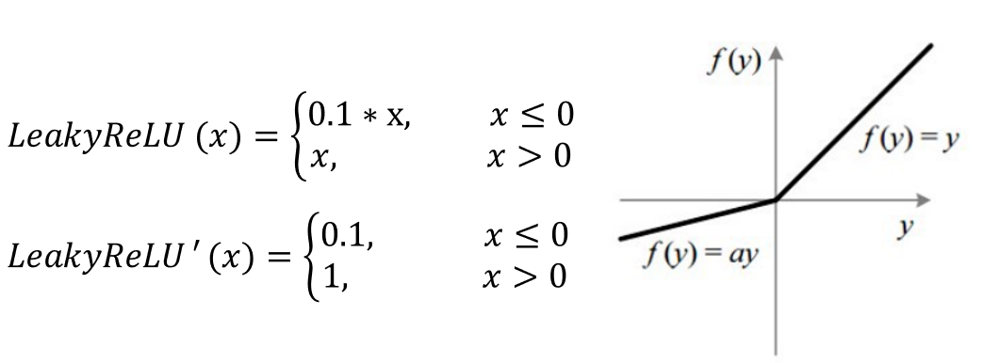

# Lab2

## 1. Introduction

這次的作業，需要用 pytorch 建構出 EEGNet 和 DeepConvNet 來分類 EEG signals，並且分別比較 ReLU, Leaky ReLU 和 ELU 的效果差異

這次的目標為：

1. Implement the EEGNet, DeepConvNet with three kinds of activation 
function including ReLU, Leaky ReLU, ELU

2. In the experiment results, you have to show the highest accuracy (not loss) of 
two architectures with three kinds of activation functions.

3. To visualize the accuracy trend, you need to plot each epoch accuracy (not 
loss) during training phase and testing phase.

### 1.1 DataSet

使用 EEG signals，shape = (1080,1,2,750) 為 (樣本數,channel,width,height)，所以我們將每一個樣本視為 2*750 大小的圖。


## 2. Experiment set up
### 2.1 The detail of model
**a. EEGNet**

依照 lab2 的要求，我將 eeg model 的架構以下方code的方式呈現，並且附上各層輸出的 shape 和 參數量。

EEG 模型基於 Depthwise Convolution + Pointwise Convolution 將原本需要大量參數的架構簡化，不僅準確率不減，還減少運算速度。

參考：https://towardsdatascience.com/a-basic-introduction-to-separable-convolutions-b99ec3102728


```python
class EEG(nn.Module):
    def __init__(self,Activate=None):
        super(EEG,self).__init__()        
        # firstconv
        self.firstconv = nn.Sequential(
            nn.Conv2d(1,16,kernel_size=(1,51),stride=(1,1),padding=(0,25),bias=False),
            nn.BatchNorm2d(16,eps=1e-5,momentum=0.1,affine=True,track_running_stats=True)
        )
        self.depthwiseConv = nn.Sequential(
            nn.Conv2d(16,32,kernel_size=(2,1),stride=(1,1),groups=16,bias=False),
            nn.BatchNorm2d(32,eps=1e-5,momentum=0.1,affine=True,track_running_stats=True),
            Activate(),
            nn.AvgPool2d(kernel_size=(1,4),stride=(1,4),padding=0),
            nn.Dropout(p=0.25)
        )
        self.separableConv = nn.Sequential(
            nn.Conv2d(32,32,kernel_size=(1,15),stride=(1,1),padding=(0,7),bias=False),
            nn.BatchNorm2d(32,eps=1e-5,momentum=0.1,affine=True,track_running_stats=True),
            Activate(),
            nn.AvgPool2d(kernel_size=(1,8),stride=(1,8),padding=0),
            nn.Dropout(p=0.25)
        )
        self.classify = nn.Sequential(
            nn.Flatten(),
            nn.Linear(in_features=736,out_features=2,bias=True)
        )
    def forward(self,x):
        x = self.firstconv(x)
        x = self.depthwiseConv(x)
        x = self.separableConv(x)
        x = self.classify(x)
        return x
```


**DeepConvNet**

依照 lab2 的要求，我將 deep conv model 的架構以下方code的方式呈現，並且附上各層輸出的 shape 和 參數量。

```python
class DeepCovNet(nn.Module):
    def __init__(self,Activate=None):
        super(DeepCovNet,self).__init__()
        C,T,N = 2,75,2
        print("DeepCovNet act:",Activate)
        if not Activate:
          Activate = nn.ELU
        
        self.conv1 = nn.Sequential(
            nn.Conv2d(1,25,(1,5),padding='valid'),
            nn.Conv2d(25,25,(C,1),padding='valid'),
            nn.BatchNorm2d(25),
            Activate(),
            nn.MaxPool2d(kernel_size=(1,2)),
            nn.Dropout(p=0.5)
        )
        self.conv2 = nn.Sequential(
            nn.Conv2d(25,50,(1,5),padding='valid'),
            nn.BatchNorm2d(50),
            Activate(),
            nn.MaxPool2d(kernel_size=(1,2)),
            nn.Dropout(p=0.5)
        )
        self.conv3 = nn.Sequential(
            nn.Conv2d(50,100,(1,5),padding='valid'),
            nn.BatchNorm2d(100),
            Activate(),
            nn.MaxPool2d(kernel_size=(1,2))
        )
        self.conv4 = nn.Sequential(
            nn.Conv2d(100,200,(1,5),padding='valid'),
            nn.BatchNorm2d(200),
            Activate(),
            nn.MaxPool2d(kernel_size=(1,2)),
            nn.Dropout(p=0.5)
        )
        self.fully = nn.Sequential(
            nn.Flatten(),
            nn.Linear(in_features=8600,out_features=2)
        )
    def forward(self,x):
        x = self.conv1(x)
        x = self.conv2(x)
        x = self.conv3(x)
        x = self.conv4(x)
        x = self.fully(x)
        return x
```


### 2.2 Explain the activation function(ReLU,Leaky ReLU,ELU)

**a. ReLU**

是一個非線性激活函數，公式與導函釋如下。

優點：計算速度比sigmoid、tanh快

缺點：(1) Dead ReLU, 當數入小於0時，會導致梯度為0。(2)因為 relu 的輸出不是0就是1 ，所以relu不是以0為中心的函數。(3)正無限大的問題


**b. Leaky ReLU**

專門設計來解決dead relu的非線性激活函數。目前尚未確定 leaky relu 一定就比 relu 好。

優點：在負數區域的梯度為0.1，解決 dead relu的問題。

缺點：(1)結果不一致，無法對正負數提供一致的相關預測。(因為不同區域有不同函數) (2)正無限大的問題

 

**c. ELU**

也專門設計來解決dead relu的非線性激活函數。而且在0的位置較為平滑。

優點：输出的平均值接近 0，以 0 為中心，計算速度比sigmoid、tanh快，計算强度更高。

缺點：(2)正無限大的問題

 

**d.其他**

reference:https://read01.com/KBPAAxN.html#.Ytev7nZBxPY

所有激活函數的導函數圖。

 

所有激活函數的公式列表

 

## 3. Experimental results

我將一些參數做調整：

```
optimizer: Adam -> NAdam

learning rate:1e-2 -> 1e-3

epoch: 300 -> 600
```

參數設定：

`loss funciton: cross entropy`

`optimizer:NAdam`

`epoch:600`

`Batch size:128`

`Learning rate :1e-3`


### 3.1 The highest testing accuracy

在 test data 上表現的狀況

 activate |ReLU  | Leaky ReLU  | ELU
------------|---------|----------|---------
EEG         |<font color='red' />87.87 %| 86.94 % | 82.78 %
DeepConvNet |78.24 %| 79.44 % | 79.54 %

**a. Screenshot with two models**

左圖： EEG
右圖：Deep Conv EEG

明顯看出，DeepConvNet架構的參數量較多！


### 3.2 Comparison figures


【發現】在DeepConvNet裡面，ELU 較快收斂，但因為我們train 的epoch數量大，所以果並沒有特別突出。在EEG裡面，反而是elu的acc較低，而relu表現較好。我想因為DeeConvNet的架構較深，所以elu比腳不會有dead relu的問題。

 

## 4. Discussion

### 4.1 使用不同optimizer比較結果：

`loss funciton: cross entropy`

`epoch:150`

`Batch size:64`

`Learning rate :1e-2`


### 4.2 使用不同 batch size 比較結果：

可以明顯看出，要達到 EEG(80%)、DeepConvNet(77%) 的準確率，如果batch size小就需要較多的epoch，如果batch size大 epoch 跑的次數就較少。
並且 EEGNet 比 DeepConvNet 使用更少的epoch。


