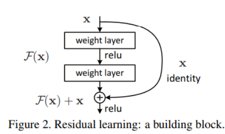
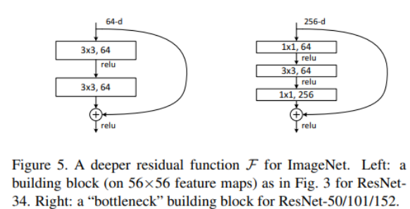
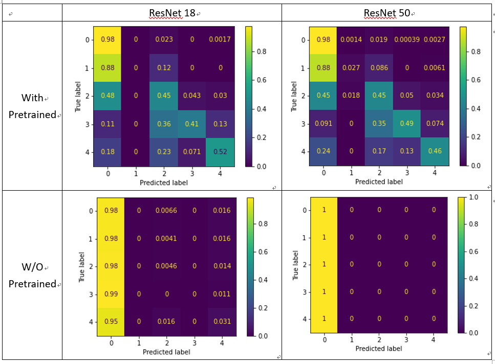
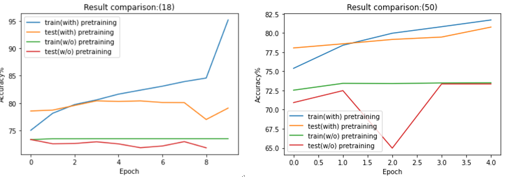
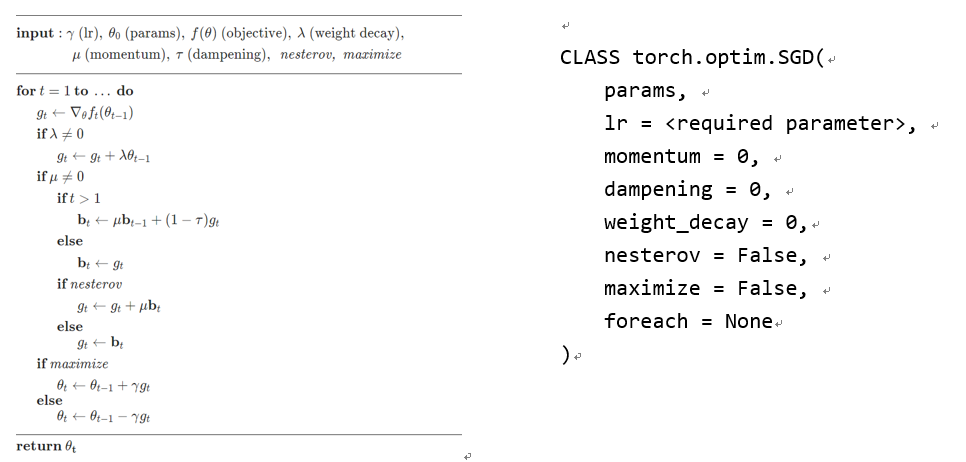
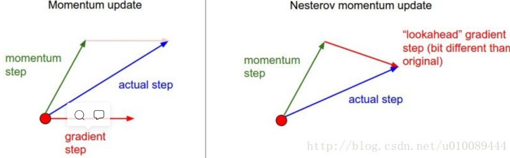
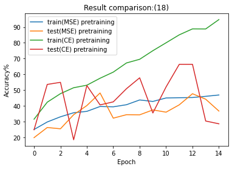

# Lab3
## 1.Introduction (20%) 
Design a Network to classify diabetic retinopathy level(0-4).(糖尿病所引發視網膜病變) 

requirement is:

1. You need to write your own **custom DataLoader** through PyTorch framework.   
   
2. You need to classify diabetic retinopathy grading via the **ResNet**.
    
3. You have to calculate the **confusion matrix** to evaluate the performance

## 1.1 DataSet

param|size
-|-
training data|28,099 images
testing data |7,025 images
Input|[B, 3, 512, 512]
Output|[B, 5]
Ground truth|[B]

(B is 28,099 or 7,035)


## 2.Experiment setups (30%)


### 2.1 The details of your model (ResNet)

**ResNet 架構**

參考：https://www.twblogs.net/a/5c3a09b4bd9eee35b21db28c

Resnet 架構由 `殘差映射(Residual Mapping)`觀念所建立，下圖為基本的 residual block。
在深度高的模型裡，時常會發生 Gradient Vanish 的問題，導致越深的架構往表現上往往沒有比較好。這邊 resnet透過 residual block 執行 skip connection 動作，相當於將`x`乘上 `weight=1` 的值，因此在做 gradient 時，這條 ski connection 的 gtradient 就為 1，可以有效預防深層網路產生的gradient vanish問題。



因此 resnet 從 layer=18 到 layer=101都有，但在高層層數的架構中，會引入 bottleneck 架構。如下左圖為一般residual block 右圖為 bottleneck 架構。

bottleneck 主要的目的為降低參數量

左圖：3x3x64x64x2 = 73,728

右圖：1x1x64x64x2+64x256 = 63,872



<br/>

以下附上 model code

```python
class ResNet(nn.Module):
    def __init__(self, pretrained=True,layers=18):
        super(ResNet, self).__init__()

        # 方便之後辨識 model 架構用
        f = lambda x : "with" if x else "w/o" 
        self.pretrained = f(pretrained)
        self.pretrained_bool = pretrained
        self.layer_num = layers       

        # 載入model
        pretrained_model = torchvision.models.__dict__[f'resnet{layers}'](pretrained)
        self.conv1 = pretrained_model._modules['conv1']
        self.bn1 = pretrained_model._modules['bn1']
        self.relu = pretrained_model._modules['relu']
        self.maxpool = pretrained_model._modules['maxpool']

        self.layer1 = pretrained_model._modules['layer1']
        self.layer2 = pretrained_model._modules['layer2']
        self.layer3 = pretrained_model._modules['layer3']
        self.layer4 = pretrained_model._modules['layer4']
        self.avgpool = nn.AdaptiveAvgPool2d(1)
        
        self.classify = nn.Sequential(
            nn.Linear(pretrained_model._modules['fc'].in_features, 256),
            nn.Dropout(p=0.25),
            nn.Linear(256, 5)
        )
        del pretrained_model
```
### 2.2 The details of your Dataloader
參考：https://pytorch.org/docs/stable/data.html#torch.utils.data.Dataset

#### a.DataSet：
分為 map-style datasets 和 iterable-style datasets 兩者皆把所提供目錄下的資料包裝成一份 DataDet檔案(大小為回檔案內資料數量)。如果要自己寫 DataSet 並用在Dataloader上，那就必須繼承DataSet這個class.

**(1) map-style datasets**：我們在此所使用的類。

**(2) iterable-style datasets**：用在 multi-processing (processing num>1)或 DataSet 的大小無法固定的資料集裡。

#### b.DataLoader：
會依照設定好的參數(batch大小，是否打亂)將所有data進行分組。而 dataloader 依照 dataset 輸入的 style 用不同方法進行分類。

**(1) map-style datasets**：會用 `torch.utils.data.Sampler` 類操作參數的規定，並且對 dataset 輸入 idx 讀取檔案 ( getitem[idx] )


**(2) iterable-style datasets**：使用者必須自行輸入 iterater 規範對dataset的讀取方式。

#### c.RetinopathyLoader：

以下依照官網提供的方式，先繼承DataSet類，並且更改 `__getiten__()` dataloader 裡的 sampler 會call 此 function。要對每張圖進行的 data augmentation 也寫在這裡。


```python
class RetinopathyLoader(Dataset):
    def __init__(self, root, mode,transform=None):
        self.root = root
        self.img_name, self.label = getData(mode)
        self.mode = mode
        if transform == None:
            self.transform = transforms.ToTensor()
        else: self.transform = transform
        print("> Found %d images..." % (len(self.img_name)))

    def __len__(self):
        return len(self.img_name)

    def __getitem__(self, index):
        
        path = self.root + self.img_name[index] + '.jpeg'
        img = Image.open(path , mode='r')

        if self.transform!=None:
            img = self.transform(img)
        label = self.label[index]

        return img, label

data_set = RetinopathyLoader('data/','train',transform=transforms)
train_data = DataLoader(data_set, batch_size=batch,shuffle=True)

```

### 2.3 Describing your evaluation through the confusion matrix 

每一個class的分布狀況如下，可以明顯看出 cls 0 的數量較多。光是全部預測都為 0 (26055/28099)就可以得到 73% 的準確率。

training cls|img num|testing cls|img num
-|-|-|-
0|20655|0|5153
1|1955|1|488
2|4210|2|1082
3|698|3|175
4|581|4|127

並且從混淆矩陣中，可以看出 `w/o pretrained` 的模型，不論是層數為 18 或50幾乎都預測圖片為cls0，並且模型50還在test acc中達到 73.35% 的準確率，所以基本上模型對於圖片特徵的辨識能力極低。

反觀 `with pretrained` 的模型，可以看出模型毀載cls0和正確cls之間選擇，並不會全都預測為cls0，只少對於每個cls有些微的辨識能力。




## 3. Experimental results (30%)
### 3.1 The highest testing accuracy
#### a. Screenshot 

-|ResNet18|ResNet50
-|-|-
with|<font color='red'>81.48</font>|80.77
w/o|73.35|73.35


#### b. Anything you want to present

這邊 ResNet18  (True) 參數做了一些調整：

`batch: 4 -> 12 `

`Epochs: 10 -> 20 `

`lr: 0.001 -> 0.01 `

`loss:CrossEntropyLoss() `

```
classify Sequential(
  (0): Linear(in_features=512, out_features=256, bias=True)
  (1): Linear(in_features=256, out_features=5, bias=True))

optimizer:SGD (
    lr: 0.001
    momentum: 0.9   # 加上部分前一次的gradient
    nesterov: True  # 加速收斂
    weight_decay: 0 # 暫時不comlixity model
)
```


### 3.2 Comparison figures
#### a. Plotting the comparison figures (RseNet18/50, with/without pretraining)



## 4. Discussion (20%) 
### 4.1 SGD

參考：https://blog.csdn.net/u010089444/article/details/76725843

官方網站的 SGD 參數設定如下



**SGD缺點**:
更新方向完全取決於前batch算出的梯度，因而十分不稳定。

**(1) momentum**：類似於動量概念，在更新的時候將當前batch梯度的方向加上一定程度上一次更新的方向，當作這次更新的方向。可以在一定程度上增加稳定性。

**(2) weight_decay**：防止overfitting，Weight Decay是一个L2 penalty是對参數取值平方和的懲罰。增加模型的複雜度


**(3) nesterov**：
提前知道在哪些地方坡面會上升，在遇到上升坡面之前，就開始减速。對計算出來新的 θ-γ * v求導, 而不是原始的θ



### 4.1 Anything you want to share

我從training data 裡每個 class 挑出 500 個 image.並分別用 `softmax+CrossEntropy` 和 `softmax + MSELoss`。CE表現較好，但 test 的震盪很大，並且有overfitting 的狀況。而 MSE 雖然穩定上升，但需要 train 很多 epoch

`test(MSE):48.28%`
`test(CE):66.43%`



### 4.2 其他

我發現，調整 `weight_decay` 對 model 的影響很大，因此在還不確定model是否會overfitting的狀況下我都會將此項調整為 0
