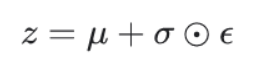

# Lab4

資⼯碩⼀ 

311551087 

歐亭昀

## 1. Introduction (5%)

以下有些方發來自論文內容， Paper 表示為這篇論文：https://arxiv.org/abs/1802.07687
### 1.1 Requirement
In this lab, needing to implement a conditional Variational Autoencoder (VAE) for video prediction.

Some requirements as follow:

    1. Modify encoder, decoder, and training functions
    2. Implement reparameterization trick.
    3. Adopt teacher-forcing and KL loss annealing in your training processing. 
    4. Plot the loss, average PSNR, KL weight and teacher forcing ratio. 

Overall architecture：


### 1.2 DataSet
Using bair robot pushing small dataset to train CVAE
This data set contains roughly 44,000 sequences of robot pushing motions, and each sequence include 30 frames.


## 2. Derivation of CVAE (Please use the same notation in Fig.1a )(10%)

參考:
https://www.youtube.com/watch?v=8zomhgKrsmQ&list=PLJV_el3uVTsPy9oCRY30oBPNLCo89yu49&index=28

https://zhuanlan.zhihu.com/p/83865427?utm_id=0&fbclid=IwAR1F_HrZov_q9l_RFWL7mOb9ySVftLOGByR2_5PIbYJGLbK_UgjFXvPMuM0

推導 VAE


因為 condition VAE在 q 和 p 這兩個 NN 上加上 Condition 的限制，所以 CVAE的推導直接引用 VAE。


## 3. Implementation details (15%)

### 3.1 Describe how you implement your model (10%)

#### 3.1.1. Encoder (VGG)

**Encoder 架構:** 
```
# paper 引用

For KTH and BAIR datasets, the frame encoder uses the same architecture as VGG16 
```

因此，使用 `VGG16` 當作 Encoder 的架構，由 [這篇論文](https://arxiv.org/abs/1409.1556)可以得到 VGG16 的架構。


<font color='blue'>**Skip Connections:** </font>

```
# paper 引用

Skip connections between encoder and decoder allow direct copying of the previous frame, allowing the rest of the model to focus on changes.
```
因此在 Encoder 回傳的地方將各層 Conv 的 output 保留下來，當成之後decoder的輸入。

```python
# My Code
def forward(self,input):    #    [sample, channel , 64, 64] 
        h1 = self.c1(input)  # h1:[4, 64, 64, 64]
                ...
        h5 = self.c5(h5)     # h5:[4, dim, 1, 1] dim=4
        return h5.view(-1, self.dim), [h1, h2, h3, h4]
```
#### 3.1.2 LSTM (posterior)

LSTM(posterior)需要輸入 x(t) 並輸出 mu,log_variance。其中從paper中得知，這個部分可由 embedding + 1層LSTMcell + Fully Connection 組成。

```
# paper
LSTMφ and LSTMψ are both single layer LSTMs with
256 cells in each layer. Each network has a linear embedding
layer and a fully connected output layer.
```

<font color='blue'>**reparameterize**</font>

參考：https://weikaiwei.com/tf/tensorflow-2-keras-mnist-vae/

參考：https://www.youtube.com/watch?v=rZufA635dq4

在訓練時，為了讓 Decoder 吃 latent representation z，我們可以從Encoder output 出來的 Distribution 參數來 sample，但在做 backpropagation 時，沒辦法讓gradient(梯度) 流過這個不能微分的地方。因此需要引入一個 reparameterization 的技巧。




```python
# MyCode
def reparameterize(self, mu, logvar):
        logvar = logvar.mul(0.5).exp_()
        eps = Variable(logvar.data.new(logvar.size()).normal_())
        return eps.mul(logvar).add_(mu)
```

#### 3.1.3 LSTM (frame predictor)

LSTM(frame predicor)是由 embedding + 2層LSTMcell + Fully Connection 組成。並且依照要求所給的架構，在進入 LSTM 前需要給位子資訊 (Action and Position) 所以這邊 LSTM 輸入的維度 ( 7 + encoder output + z dimention )。

```
# paper

LSTMθ is a two layer LSTMs with 256 cells in each layer.
The output of LSTMθ is passed through a tanh nonlinearity before going
into the frame decoder
```
#### 3.1.4 Decoder (VGG)
**Decoder 架構:** 

架構基本上是 Encoder 的相反過來，只有將 pooling 的地方改成 up-sampling+sigmoid。
```
# paper引用

The decoder is a mirrored version of the encoder
with pooling layers replaced with spatial up-sampling and
a sigmoid output layer
```


```python
def forward(self, input):
        vec, skip = input 
        d1 = self.upconv1(vec.view(-1, self.dim, 1, 1)) # 1 -> 4
        up1 = self.up_sampling(d1) # 4 -> 8
                ...
                ...
        output = self.upc5(torch.cat([up4, skip[0]], 1)) # 64 x 64
return output
```


#### 3.1.5 Dataloader

**Get Picture**

回傳大小為 `[12,30,3,64,64]` 的 tensor `[batch size,time,channel,width,height]`

**Get Position Condition & Action**
回傳大小為 `[12,7]` 的 tensor `[batch size,features]`

#### <font color='blue'>3.1.6  KL  annealing</font>

參考：https://github.com/haofuml/cyclical_annealing

https://zhuanlan.zhihu.com/p/64071467


目的：防止 KL vanish
在訓練的前期，kl=0 在 q(z|x) 中，讓 x 多一點時間學習如何 encoder 出 z 。


```python
# MyCode
class kl_annealing():
    def __init__(self, args):
        super().__init__()
        self.n_epoch = args.niter*args.epoch_size
        self.n_cycle = args.kl_anneal_cycle
        self.ratio = args.kl_anneal_ratio
        self.cyclical = args.kl_anneal_cyclical     
        L = np.ones(self.n_epoch)
        start,stop = 0,1
        if self.cyclical:
            period = self.n_epoch/self.n_cycle
            step = (stop-start)/(period*self.ratio) # linear schedule
            for c in range(self.n_cycle):
                v , i = start , 0
                while v <= stop and (int(i+c*period) < self.n_epoch):
                    L[int(i+c*period)] = v
                    v += step
                    i += 1
        self.beta_cyc = L
        self.now = -1
    def update(self):
        self.now+=1
        return
    def get_beta(self):
        self.update()
        return self.beta_cyc[self.now]
```

#### <font color='blue'>3.6.7 teaching force 架構</font>

依照每個epoch更新

<image src='image/tfr.png' width=35% />

```python
if args.tfr_decay_step == 0:
        args.tfr_decay_step = 1/(niter-args.tfr_start_decay_epoch)

if epoch >= args.tfr_start_decay_epoch:
            ### Update teacher forcing ratio ###
            args.tfr = 1 - args.tfr_decay_step*(epoch- args.tfr_start_decay_epoch)
            print("tfr:",args.tfr)
```


### 3.2 Describe the teacher forcing  (5%)


訓練時：比較random和tfr，False時用前一時刻的output當輸入，True時則用 ground truth當輸入。

```python
# training process 
use_teacher_forcing = True if random.random() < args.tfr else False
x_pred_list=[x[0]]
for i in range(1, args.n_past + args.n_future):    
   if use_teacher_forcing:
        x_t_last = x[i-1]
   else:
        x_t_last = x_pred_list[i-1]
```

測試時：直接將前一時刻的預測當輸入。

```python
# utils.pred()
x_pred_list=[x[0]]
for i in range(1, args.n_past + args.n_future):
        x_t_last = x_pred_list[i-1]
```

#### 3.2.1 including main idea

參考：https://blog.csdn.net/wl1710582732/article/details/88636852

teacher forcing 在 RNN 的架構中常被使用。主要是將 x(t-1) 的 ground truth 跟著輸入進 model 中一同預測 t 時間的值(非使用 x_hat(t-1)當輸入)。

依照我們的架構，在訓練模型時會將 x(t-1) 輸入架構中預測 x(t)。 如果我們設 teaching force ratio=1，則 x(t-1) 為 ground truth。如果random出來的值小於 teaching force ratio，則 x(t-1) 為上一輪我們預測出來值。

#### 3.2.2 benefits

參考：https://blog.csdn.net/qq_30219017/article/details/89090690#_Teacher_Forcing_12

因為模型在訓練時依據前一時間點的預測結果作為輸入，所以當前一時間預測的不好時，連帶會影響下一時間點的預測，**錯誤的累積容易使模型很難收斂**。因此使用 tf 可以使模型不會因為前一時間錯誤的預測而造成下一時刻預測的偏差。

#### 3.3.3 drawbacks

因為模型的預測重度依賴前一時刻的ground truth，因次在training時會有好的表現，但在 testing時因為不能依據前一時刻的ground truth(trf=0)所以訓練的表現會差很多。

## 4. Results and discussion (30%)

### 4.1 Show your results of video prediction (10%)

<font color='red'>Best Score:25.91696</font>


#### 4.1.1 Make videos or gif images for test result (select one sequence)

左:ground truth 右：predict


#### 4.1.2 Output the prediction at each time step (select one sequence)

上：ground truth 下：predict


### 4.2 Plot the KL loss and PSNR curves during training (5%)

明顯看出當 tfr 下降時 loss上升


使用 kl=monotonic


### 4.3 Discuss the results according to your setting of teacher forcing ratio, KL weight,and learning rate. 

`teaching force ratio start epoch = 75`

`KL weight ratio=1 / cycle=4`

`learning rate = 0.002 `

(1) 設定 tfr start=50：發現學習的速度偏慢，並且在前幾個epoch因為 tfr 小所以就 learn 的較差。因此我希望可以將正確學習的時間條長一點，所把 ` tfr=50 -> 75 `

(2) 設定 KL weight：cycle是依照niter/100的次數做調整。


