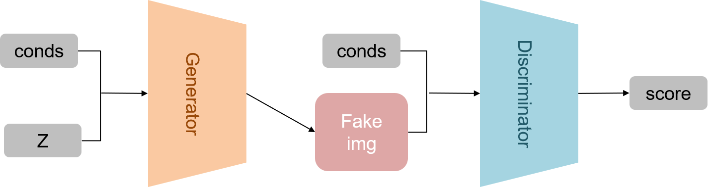
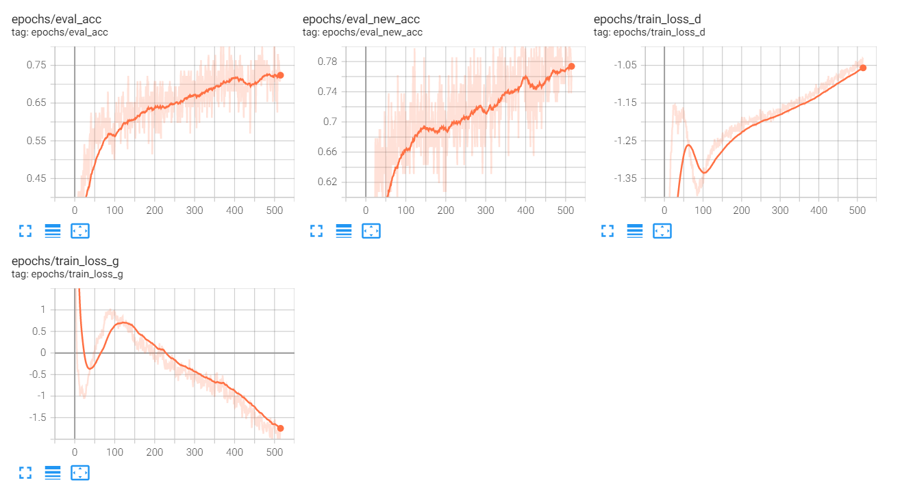
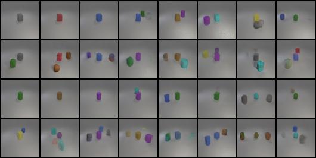
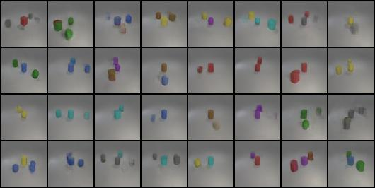
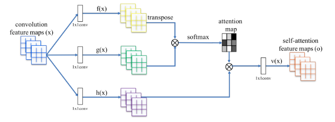
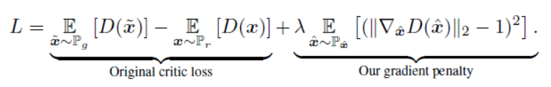

# Lab 5
311551087
資科工所
歐亭昀
## 1. Introduction (5%)

嘗試使用架構：
1. SAGAN
2. WGAN (表現最好)
3. DCGAN

嘗試使用的 loss funciton：
1. Normal (KL、JS)
2. WGAN-gp (Wasserstein)

### 1.1 Requirement
In this lab, you need to implement a conditional GAN and generate synthetic images based on multi-labels conditions.

Show the conditional GAN structure below.

<p align="center">
    
</p>

### 1.2 DataSet

**object.json**：每個種類的圖像，在 code 中用來當 condition
```
{"gray cube": 0, "red cube": 1, "blue cube": 2, "green cube": 3, "brown cube": 4, "purple cube": 5, "cyan cube": 6, "yellow cube": 7, "gray sphere": 8, "red sphere": 9, "blue sphere": 10, "green sphere": 11, "brown sphere": 12, "purple sphere": 13, "cyan sphere": 14, "yellow sphere": 15, "gray cylinder": 16, "red cylinder": 17, "blue cylinder": 18, "green cylinder": 19, "brown cylinder": 20, "purple cylinder": 21, "cyan cylinder": 22, "yellow cylinder": 23}
```

**train.json**：每張圖像的名稱+內容物。

```
{"CLEVR_train_002066_0.png": ["cyan cube"], "CLEVR_train_002066_1.png": ["cyan cube", "cyan sphere"], "CLEVR_train_002066_2.png": ["cyan cube", "cyan sphere", 
```

**test.json、new_test.json**：要求生成的圖像中需含的內容物
```
[["gray cube"], ["red cube"], ["blue cube"], ["blue cube", "green cube"]
```
## 2 Implementation details
### 2.1 Describe how you implement your model(15%)

**Condition**

是由 `Generator`、`Discriminator`兩個架構組成，一般的 GAN 輸入為一組由高斯分布取出的 vector(z-vector)，餵入 G 後，再經由 G 生成一張圖片(64x64x3)，將生成的圖片餵進 D 中，D 會判別輸入圖是否為真實的圖並給予一個分數(score)，分數越高越肯定為真實圖。 

但普通 GAN 無法特別決定輸出類型，因此引入 `condition`，並且將 conds 分別輸入 G 和 D 兩個模型，幫助生成與判別指定類型。

**Depp GNN**

然而 condtition GAN 因為是由一組 `z-vec` 經由 fully connection 生成大小為 64X64X3 的 vector，所以既然是要生成與判斷圖片，這邊就將擁有強大特徵提取能力的 `Deep CNN` 的架構引入 G 和 D 中作為生成與判斷圖片的方法。

**WGAN - gp**

WGAN 的 Generator、Discrimation 為一般 DCGAN 架構，但 loss 使用`Wasserstein`距離公式。

**Generator** 這邊示範 DCGAN + WGAN-gp

```python
class Generator(nn.Module):
    def __init__(self, batch_size, image_size=64, z_dim=100, conv_dim=64,num_cond=24,c_size=100):

        super(W_Generator, self).__init__()
        self.imsize = image_size        
        self.c_size=c_size

        # 將 condition 做 Embedding
        self.embed_c=nn.Sequential(
            nn.Linear(num_cond,c_size),
            nn.ReLU(inplace=True)
        )

        # 因為 64 = 2^6 所以至少要做 6 次 upsampling 
        repeat_num = int(np.log2(self.imsize)) - 3  # 6-3=3
        mult = 2 ** repeat_num # 8

        # 第一層 up sampling convalution
        self.l1 = nn.Sequential(
            nn.ConvTranspose2d(z_dim+c_size, conv_dim * mult, kernel_size=4),   # 1 -> 4
            nn.BatchNorm2d(conv_dim * mult),
            nn.ReLU(),
        )

        curr_dim = conv_dim * mult
        
        # 第二層 up sampling convalution
        self.l2 = nn.Sequential(
            nn.ConvTranspose2d(curr_dim, int(curr_dim / 2), kernel_size=4, stride=2, padding=1),    # 4 -> 8(6-2+3+0+1)
            nn.BatchNorm2d(int(curr_dim / 2)),
            nn.ReLU(),
         )

        curr_dim = int(curr_dim / 2)

        # 第三層 up sampling convalution
        self.l3 = nn.Sequential(
            nn.ConvTranspose2d(curr_dim, int(curr_dim / 2), kernel_size=4, stride=2, padding=1),   # 8 -> 16
            nn.BatchNorm2d(int(curr_dim / 2)),
            nn.ReLU(),
        )

        curr_dim = int(curr_dim / 2)

        # 第四層 up sampling convalution
        self.l4 = nn.Sequential(
            nn.ConvTranspose2d(curr_dim, int(curr_dim / 2), kernel_size=4, stride=2, padding=1),  # 16 -> 32
            nn.BatchNorm2d(int(curr_dim / 2)),
            nn.ReLU(),

        )

        # 第五層 up sampling convalution
        self.l4 = nn.Sequential(
            nn.ConvTranspose2d(curr_dim, int(cu
        curr_dim = int(curr_dim / 2)

        # 最後一層 up sampling convalution
        self.last = nn.ConvTranspose2d(curr_dim, 3, 4, 2, 1)# 32 -> 64
```

**Discriminator**這邊示範 DCGAN + WGAN-gp

使用 WGAN-gp 的方法，Discriminator 不能使用 Batch Normalization

```python
class Discriminator(nn.Module):
    def __init__(self, batch_size=64, image_size=64, conv_dim=64,num_cond=24):
        super(W_Discriminator, self).__init__()
        self.imsize = image_size
        
        # 將 condition 做 Embedding
        self.embed_c=nn.Sequential(
            nn.Linear(num_cond,self.imsize*self.imsize),
            nn.ReLU(inplace=True)
        )

        # 第一層 Convalution 
        self.l1 = nn.Sequential(
            nn.Conv2d(4, conv_dim, kernel_size=4, stride=2, padding=1),
            nn.LeakyReLU(0.1))

        curr_dim = conv_dim

        
        # 第二層 Convalution 
        self.l2 = nn.Sequential(
            nn.Conv2d(curr_dim, curr_dim * 2, 4, 2, 1),
            nn.LeakyReLU(0.1)

        )

        curr_dim = curr_dim * 2

        
        # 第三層 Convalution 
        self.l3 = nn.Sequential(
            nn.Conv2d(curr_dim, curr_dim * 2, 4, 2, 1),
            nn.LeakyReLU(0.1)
        )
        curr_dim = curr_dim * 2

        
        # 第四層 Convalution 
        self.l4 = nn.Sequential(
            nn.Conv2d(curr_dim, curr_dim * 2, 4, 2, 1),
            nn.LeakyReLU(0.1)
        )
        curr_dim = curr_dim*2

        # 第五層 Convalution 
        self.last = nn.Conv2d(curr_dim, 1, 4)
```


### 2.2 Specify the hyperparameters (learning rate, epochs, etc.) (5%)

`batch size = 64`   

`z-size = 128`

`g-conv-dim = 300`  kernel map 在每一層的conv的相對數量

`d-conv-dim = 100`  kernel map 在每一層的conv的相對數量

`g-lr = 0.0001`     網路上找 G 的 lr 都小於 D 的 lr，差不多羅在1e-4左右

`d-lr = 0.0004`

`beta1 = 0`

`beta2 = 0.9`

`lambda-gp = 10`  網路上找，使用 wgan- gp 推薦的 lambda 參數


**epoch**：`300 -> 600`

**learning rate**：直接套用[參考文章](https://github.com/heykeetae/Self-Attention-GAN)提供的 lr

**c-size**：我使用一層linear將 condition 從原本 24 embedding到100，因為只是要存更多資訊所以就找個比24大一些的數字。


## Results and discussion (25%)
### Show your results based on the testing data. (5%)



test.json best accuracy: <font color='red'> 0.8333</font>

<image src='image/test_acc.png' width=15.5% /> 


new_test.json best accuracy: <font color='red'>0.85714</font>

<image src='image/new_test_acc.png' width=17% /> 

### Discuss the results of different models architectures. (20%) For example, what is the effect with or without some specific loss terms, or what kinds of condition design is more effective to help cGAN


我有嘗試用 1. 一般 DCGAN 2. SAGAN
    
並且只有在 WGAN 有測試 new_test.json：test acc/new_test acc

(acc/epochs) |loss function|  100  | 150  | 300
-|-|-|-|-
WGAN|Wasserstein|0.70833 |0.73611| 0.79167
SAGAN|Wasserstein|0.65278 |0.70833| 0.70833 
DcGAN|KL、JS|0.5645|0.69403|0.71045

可以看出有用 Wasserstein  loss 計算會比較容易收斂。

#### 其他使用模型： SAGAN　架構

**(1)Salf Attention**

是將 self attention 帶入 GAN 的一方法，它可以生成出重點矩陣，幫助 GAN 在生成與判斷更為正確。因此我將 Sself Attention 帶入 DCGAN 中。




```python
class Self_Attn(nn.Module):
    """ Self attention Layer"""
    def __init__(self,in_dim,activation):
        super(Self_Attn,self).__init__()
        self.chanel_in = in_dim
        self.activation = activation
        
        self.query_conv = nn.Conv2d(in_channels = in_dim , out_channels = in_dim//8 , kernel_size= 1)
        self.key_conv = nn.Conv2d(in_channels = in_dim , out_channels = in_dim//8 , kernel_size= 1)
        self.value_conv = nn.Conv2d(in_channels = in_dim , out_channels = in_dim , kernel_size= 1)
        self.gamma = nn.Parameter(torch.zeros(1))

        self.softmax  = nn.Softmax(dim=-1) #
    def forward(self,x):
        """
            inputs :
                x : input feature maps( B X C X W X H)
            returns :
                out : self attention value + input feature 
                attention: B X N X N (N is Width*Height)
        """
        m_batchsize,C,width ,height = x.size()
        proj_query  = self.query_conv(x).view(m_batchsize,-1,width*height).permute(0,2,1) # B X CX(N)
        proj_key =  self.key_conv(x).view(m_batchsize,-1,width*height) # B X C x (*W*H)
        energy =  torch.bmm(proj_query,proj_key) # transpose check
        attention = self.softmax(energy) # BX (N) X (N) 
        proj_value = self.value_conv(x).view(m_batchsize,-1,width*height) # B X C X N

        out = torch.bmm(proj_value,attention.permute(0,2,1) )
        out = out.view(m_batchsize,C,width,height)
        
        out = self.gamma*out + x
        return out,attention

```

**(2)SpectralNorm**

再參考[這篇](https://github.com/heykeetae/Self-Attention-GAN) SAGAN 的 code 時，我發現他有引入 Spectral Norm，研究了一下發現 Spectral Norm 是為了解決GAN訓練不穩定的問題，從"層引數"的角度用spectral normalization的方式施加regularization，從而使判別器D具備Lipschitz連續條件(WAGAN 中解釋)。因此這邊，我也依照 [這篇](https://github.com/heykeetae/Self-Attention-GAN) SAGAN的code把 SpectralNorm 加進 Generator 和 Discriminator。

#### 其他使用的 Loss Function：WAGAN-gp

上課中，有學到 [WGAN](https://arxiv.org/abs/1701.07875)，是以 `Wasserstein`距離公式代替原本的 KL 和 JS。這個loss的計算方法大幅度改善 GAN 困難訓練的問題。

其中WGAN 為了使用 Wasserstein 距離，所以用將模型的 weight 做 clip，WGAN-gp的作者將 clip 的部分改掉，換成在 descriminator 的loss 上加上一個正規項(gradient penalty 梯度約束)，達成 clip 的效果。


Discriminator 的 loss 公式加上 GP



```python
# ========== Train Discriminator =========== #
d_out_real,dr1,dr2 = D(img, conds)
d_loss_real = -torch.mean(d_out_real)

z = utils.tensor2var(torch.randn(args.bs, args.z_size))
fake_images,gf1,gf2 = G(z, conds)
d_out_fake,df1,df2 = D(fake_images, conds)
d_loss_fake = torch.mean(d_out_fake)

# ========== original critic loss =========== #
d_loss = d_loss_real + d_loss_fake
d_optimizer.zero_grad()
d_loss.backward()
d_optimizer.step()

# ========== Compute gradient penalty =========== #
alpha = torch.rand(args.bs, 1, 1, 1).to(args.device).expand_as(img)
interpolated = Variable(alpha * img.data + (1 - alpha) * fake_images.data, requires_grad=True)
out,_,_ = D(interpolated,conds)
grad = torch.autograd.grad( outputs=out,
                            inputs=interpolated,
                            grad_outputs=torch.ones(out.size()).to(args.device),
                            retain_graph=True,
                            create_graph=True,
                            only_inputs=True)[0]

grad = grad.view(grad.size(0), -1)
grad_l2norm = torch.sqrt(torch.sum(grad ** 2, dim=1))
d_loss_gp = torch.mean((grad_l2norm - 1) ** 2)

# ========== our gradient panelty =========== #
d_loss_gp =  args.lambda_gp * d_loss_gp
d_optimizer.zero_grad()
d_loss_gp.backward()
d_optimizer.step()
```


參考資料：

https://github.com/joycenerd/Deep_Learning_Practice_labs/blob/3dde335825bd727c862364127734c7aa15aa3235/lab5/network/sagan.py

self attention:
https://mofanpy.com/tutorials/machine-learning/gan/sagan/

sagan:
https://github.com/heykeetae/Self-Attention-GAN/blob/master/sagan_models.py

spectural:
https://blog.csdn.net/qq_26020233/article/details/90448363

wgan:
https://zhuanlan.zhihu.com/p/25071913

wgan gp:
https://zhuanlan.zhihu.com/p/52799555


