# Lab6
311551087
資科工所
歐亭昀
## 1.Introduction
### 1.1 Requirement
In this lab, you will learn and implement two deep reinforcement algorithms by completing the following two tasks: 

(1) solve LunarLander-v2 using deep Q-network (DQN), and 

(2) solve LunarLanderContinuous-v2 using deep deterministic policy gradient (DDPG).


## 2. training episodes in LunarLander-v2 (5%)
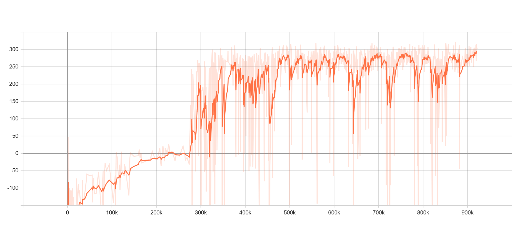

## 3. episodes in LunarLanderContinuous-v2 (5%)

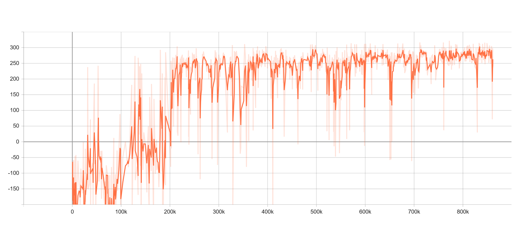

## 4. Describe your major implementation of both algorithms in detail. (20%)

###  4.1 LunarLander-v2 

#### 4.1.1 train & test

train 和 test 的 funciton 最大的差別在於，test不用 update 並且不用先 warm up 所以直接 select_action 完 把 reward 加總就行。 
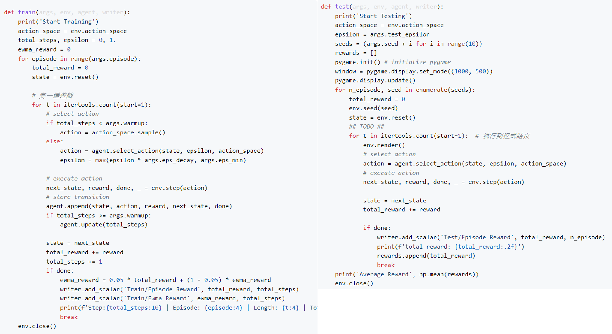

#### 4.1.2 DQN network
Actor的架構，其中使用助教預設的 parameter，optimizer 使用 Adam。

#### 4.1.3 behavior_net
 behavior net 和 target net 架構皆為 class Net()，因為環境為 LunarLander-v2，在這個環境中，狀態(observation)有8個，而動作(action)有4個，所以這邊設 `state_dim=8` 而 `action_dim=4`，然後依照助教提供的 tips 建構三層 fc。

```python
# Actor 架構
class Net(nn.Module):
    def __init__(self, state_dim=8, action_dim=4, hidden_dim=[400,300]):
        super().__init__()
        ## TODO ##
        self.layer = nn.Sequential(
            nn.Linear(state_dim,hidden_dim[0]),
            nn.ReLU(),
            nn.Linear(hidden_dim[0],hidden_dim[1]),
            nn.ReLU(),
            nn.Linear(hidden_dim[1],action_dim)
        )

    def forward(self, x):
        ## TODO ##
        return self.layer(x)
```
#### 4.1.4 select action
在 episode > warm-up 後，就開始讓 actor 預測動作。其中分成

(1) explore 探索:從env可用的動作中隨機挑選一個動作，有可能挑選到warm up階段未使用過的動作。

(2) exploit 利用: 將環境 state 輸入進 behavor_net，讓 behavior net 預測要執行的動作。

```python
def select_action(self, state, epsilon, action_space):
    '''epsilon-greedy based on behavior network'''
        ## TODO ##
    if random.random() < epsilon:   #explore
        return action_space.sample()    # 使用隨機的動作(可能為新的)  
    else:   # exploit 
        with torch.no_grad():   # 從 behavior net 中預測出最高分的動作的
            return self._behavior_net(torch.from_numpy(state).view(1,-1).to(self.device)).max(dim=1)[1].item()   
    
```

#### 4.1.5 update behavior:
因為 dqn 可以 off-line 學習。所以每次預測都會把環境狀態(state)、預測的動作(action)、獎勵(reward)、動作所產生的下個狀態(next_state)、結束done(True/False)存進 memory裡面，等到 update behavior net 時再隨抽出一個例子作為更新時使用。

```python
def _update_behavior_network(self, gamma):
    # sample a minibatch of transitions
    state, action, reward, next_state, done = self._memory.sample(self.batch_size, self.device)

    ## TODO ##
    q_value = self._behavior_net(state).gather(dim=1,index=action.long())   # 輸入state，可以得到的最大reward

    with torch.no_grad():
        q_next =  self._target_net(next_state).max(dim=1)[0].view(-1,1)
        q_target = reward + gamma*q_next*(1-done)    # if done=False then (1-done)=1 

    loss = nn.MSELoss()(q_value, q_target)

    # optimize
    self._optimizer.zero_grad()
    loss.backward()
    nn.utils.clip_grad_norm_(self._behavior_net.parameters(), 5)    #??
    self._optimizer.step()
```

#### 4.1.6 update target net
因為在 loss function 中，q_value和q_target皆由相同的 behavior net 預測出來，所以在更新 behavior net 的同時會造成目標(q_target)不同，導致每次更新都會有不同目標。因此dqn導入 target net 的機制，讓 behavio net 更新數次(target_freq)後將 behavior net 覆蓋 target net。

```python
def _update_target_network(self):
    '''update target network by copying from behavior network'''
    ## TODO ##
    self._target_net.load_state_dict(self._behavior_net.state_dict())
    
```
###  4.2 LunarLanderContinuous-v2

參考：https://zhuanlan.zhihu.com/p/111257402?fbclid=IwAR1miIYRrAGMaXCD5hZwx4Y4sjHT-SGyHQPJaJG3WNBeTpKVSaGk8MV_FIw

https://darren1231.pixnet.net/blog/post/350102095?fbclid=IwAR0YnPdtoVlc23FAxAbqz4pNmjPoPMwIoHUovyEDZUUmhXdXAkQNbRYNL8Y

DDPG 融合了Actor-Critic與DQN的experience replay而演化而來的演算法
##### 4.2.1 train & test
 train 和 test跟dqn非常像，同樣test和 train不同的地方在於是否有更新。並且因為 ddpg 也是 off line 的訓練，所以會將每一次的 state、 action、next_state、reward、done 存入memory 中。

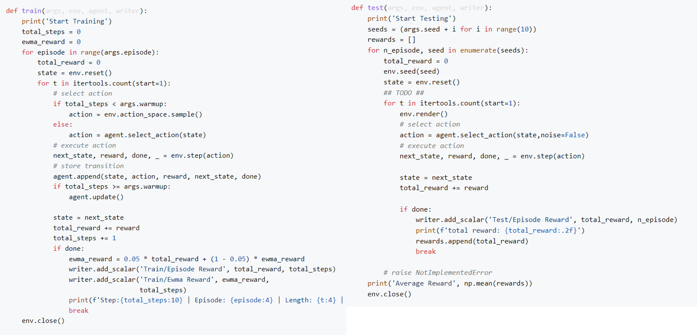

##### 4.2.2 actor_net
這邊的 Actor Net 和 dqn 中的 behavior net 相同，都是輸入狀態(state)，輸入動作。只是這邊的動作因為是連續的，所以只需要 left 和 right 的輸出量，但因為我們不希望輸出無限大或小，所以這邊用 tanh 作為限制，讓輸入只會再 -1~1之間。

```python
class ActorNet(nn.Module):
    def __init__(self, state_dim=8, action_dim=2, hidden_dim=(400, 300)):
        super().__init__()
        ## TODO ##
        # raise NotImplementedError
        self.layer = nn.Sequential(
            nn.Linear(state_dim,hidden_dim[0]),
            nn.ReLU(),
            nn.Linear(hidden_dim[0],hidden_dim[1]),
            nn.ReLU(),
            nn.Linear(hidden_dim[1],action_dim),
            nn.Tanh()
        )
    def forward(self, x):
        ## TODO ##
        # raise NotImplementedError
        return self.layer(x)
```

##### 4.2.3 critic_net
從下圖可以看出，critic net 的輸入輸出，(這個架構主要沿自 Actor-Critic 架構)，critict 的作用是在更新 actor，更新階段算 actor 所選出的動作的 q_value，作為更新actor的loss。

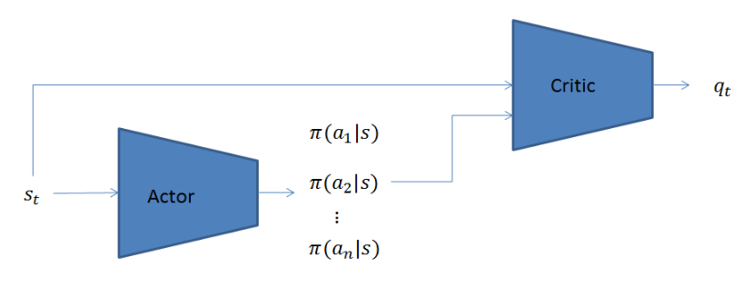


```python
class CriticNet(nn.Module):
    def __init__(self, state_dim=8, action_dim=2, hidden_dim=(400, 300)):
        super().__init__()
        self.critic_head = nn.Sequential(
            nn.Linear(state_dim + action_dim, hidden_dim[0]),
            nn.ReLU(),
        )
        self.critic = nn.Sequential(
            nn.Linear(hidden_dim[0], hidden_dim[1]),
            nn.ReLU(),
            nn.Linear(hidden_dim[1], 1),
        )

    def forward(self, x, action):
        x = self.critic_head(torch.cat([x, action], dim=1))
        return self.critic(x)

```

##### 4.2.4 select_action

這邊select分成有加 noise 和直接預測出來，我從網路上查到，是因連續動作空間的RL學習的一個困難時action的探索。DDPG中通過在action基礎上增加Noise方式解決這個問題。

```python
def select_action(self, state, noise=True):
    '''based on the behavior (actor) network and exploration noise'''
    ## TODO ##
    # raise NotImplementedError
    with torch.no_grad():
        if noise: # 連續動作空間的RL學習的一個困難時action的探索。DDPG中通過在action基礎上增加Noise方式解決這個問題。
            re = self._actor_net(torch.from_numpy(state).view(1,-1).to(self.device))+torch.from_numpy(self._action_noise.sample()).view(1,-1).to(self.device)
        else:
            re = self._actor_net(torch.from_numpy(state).view(1,-1).to(self.device))
    return re.cpu().numpy().squeeze()

```

##### 4.2.5 update behavior

分為兩個部份，(1)更新 critic (2) 更新 actor

(1)更新 critic:下圖為更新 critic 的方法，由 target 網路生成 q_target 與 reward，再和 actor-critic 網路生成的 q_value 做 loss 來更新 critic。


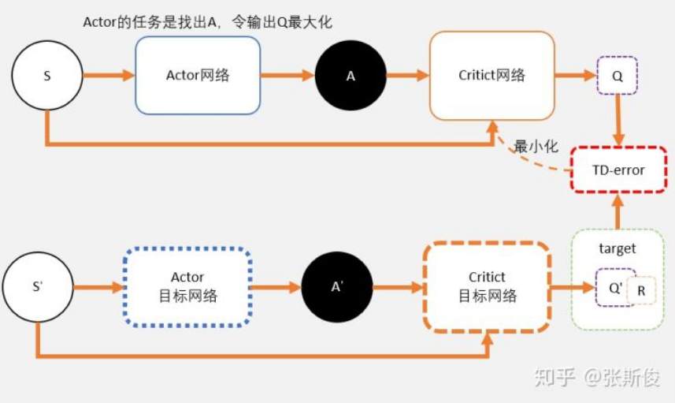

(2)更新 actor: ddpg 也為 off-line 學習，所以在更新時也有從 memory中抽出 sample，並且從下圖可以看出，更新actor是從 critic算出 q_value，加上負號可以想成是因為希望對的 actor 選的動作的 q_value 被最大化，從 loss 的角度來思考就加上負號: -(最大化)。


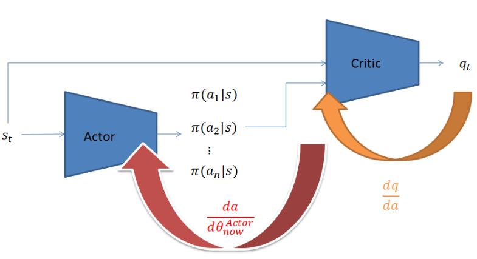


```python
def _update_behavior_network(self, gamma):
        actor_net, critic_net, target_actor_net, target_critic_net = self._actor_net, self._critic_net, self._target_actor_net, self._target_critic_net
        actor_opt, critic_opt = self._actor_opt, self._critic_opt

        # sample a minibatch of transitions
        state, action, reward, next_state, done = self._memory.sample(self.batch_size, self.device)

        ## update critic ##
        # critic loss
        ## TODO ##
        q_value = self._critic_net(state,action)
        with torch.no_grad():
           a_next = self._target_actor_net(next_state)
           q_next = self._target_critic_net(next_state,a_next)
           q_target = reward + gamma*q_next*(1-done)
        criterion = nn.MSELoss()
        critic_loss = criterion(q_value, q_target)
        # raise NotImplementedError
        # optimize critic
        actor_net.zero_grad()
        critic_net.zero_grad()
        critic_loss.backward()
        critic_opt.step()

        ## update actor ##
        # actor loss
        ## TODO ##
        action = self._actor_net(state)
        actor_loss = -self._critic_net(state,action).mean()
        # raise NotImplementedError
        # optimize actor
        actor_net.zero_grad()
        critic_net.zero_grad()
        actor_loss.backward()
        actor_opt.step()
```

##### 4.2.6 update target(soft_copying)

因此完整的DDPG，在取代target網路的時候論文不是採取複製全部的權重而是使用逐漸的取代並且設置一個參數來決定取代的比重，所以和 dqn 不同的地方是這邊我們不設定 target_freq 來更新，而是每次更新 behavior就更新 target。

```python
def update(self):
        # update the behavior networks
        self._update_behavior_network(self.gamma)
        # update the target networks
        self._update_target_network(self._target_actor_net, self._actor_net,self.tau)
        self._update_target_network(self._target_critic_net, self._critic_net,self.tau)

def _update_target_network(target_net, net, tau):
        '''update target network by _soft_ copying from behavior network'''
        for target, behavior in zip(target_net.parameters(), net.parameters()):
            ## TODO ##
            # raise NotImplementedError
            target.data.copy_((1-tau)*target.data + tau*behavior.data)
```


## 5.Describe differences between your implementation and algorithms. (10%)

設定一個 warm up 數量，在 episode < warm up 時僅做隨機探索(從所有可用的action中選出一個動作)，並將 transition 存入 actor 的 memory 中。設計為了讓 memory 中的 action 多樣性增加。

在 BQN 中，不是每個 iteration 都更新 behavior network，有設定在一定數量更新一次。

在 BQN 中，我用 BCEloss 而非 MSEloss。


## 6.Describe your implementation and the gradient of actor updating. (10%)

### 6.1 DQN

code 的部分寫在 [4.1.5](#415-update-behavior)，主要是從 memory 中 sample 出一個經驗，將 sample 的 state 輸入target_behavior 和 behavior 並算出 q_target 和 q_value，再依照下方公式算出loss。

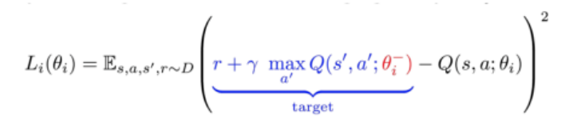


### 6.2 DDPG

code 的部分在 [4.2.5](#425-update-behavior) 主要是透過已更新的 critic 算出 q_value，但因希望 q_value越大越好，所以 min{-(q_value)}。

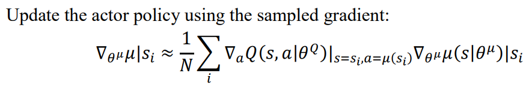


## 7. Describe your implementation and the gradient of critic updating. (10%)

code 部分在 [4.2.5](#425-update-behavior)，主要是將從 memory sample 出來的 state 分別經過 actor-critic 和 target actor-critic 算出 q_value 和 q_target，並希望 q_value 越接近 q_target 越好。

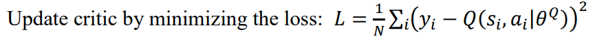


## 8. Explain effects of the discount factor. (5%)

[參考1](https://medium.com/%E9%9B%9E%E9%9B%9E%E8%88%87%E5%85%94%E5%85%94%E7%9A%84%E5%B7%A5%E7%A8%8B%E4%B8%96%E7%95%8C/%E6%A9%9F%E5%99%A8%E5%AD%B8%E7%BF%92-ml-note-reinforcement-learning-%E5%BC%B7%E5%8C%96%E5%AD%B8%E7%BF%92-dqn-%E5%AF%A6%E4%BD%9Catari-game-7f9185f833b0)、
[參考2](https://mofanpy.com/tutorials/machine-learning/reinforcement-learning/intro-sarsa-lambda)

定義目前 action 的好壞，可以想像成這個狀態對未來reward的重要成度(期望)，狀態對未來每一個時間點的reward相加， λ是discount factor，意思就是說，在 done 後，離 done 越遠的步伐的動要程度。


## 9. Explain benefits of epsilon-greedy in comparison to greedy action selection. (5%)

greddy action selection 僅會用以之結果中，結果最好的 action，可能會造成有些 action 因為沒被用過而不知是否結果最好而被忽略。因此使用 epsilon-greedy 讓 NN 有機會從所有的 action 隨機選擇，這樣有可能挖掘到沒使用過但效果卻相對佳的方法。

## 10. Explain the necessity of the target network. (5%)

參考：https://www.wpgdadatong.com/tw/blog/detail?BID=B2382

behavior network的更新目標是將 q_value 越接近 q_target 越好，但在更新NN時(調整NN讓 q_value 接近 q_target)，同時會造成 q_target的計算結果改變(因為是同一個NN)，所以用一個 target network 計算 q_target，分開target 和 value 的計算，然後經過一些時間後，把訓練用的參數給復製到計算 q_target 的網路。這樣可以讓網路的訓練更加穩定

## 11. Explain the effect of replay buffer size in case of too large or too small. (5%)

buffer size 太大：佔memory、因為新加入的 sample 就要等很久才能被採樣到，若不幸的是這個非常重要，那麼需要等很久才能發揮作用，所以整個學習過程就變慢了。

buffer size 太小：較容易overfitting、只專注在近期的trajectories可能退化成了不使用buffer的情況。

## 12. [LunarLander-v2] Average reward of 10 testing episodes: Average ÷ 30

280.17/30 =<font color='red' >  9.3 </font>

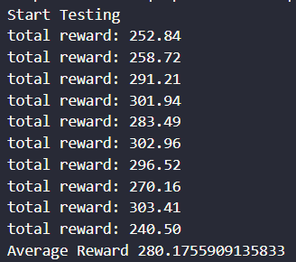

## 13. [LunarLanderContinuous-v2] Average reward of 10 testing episodes: Average ÷ 30

287.97/30 = <font color='red'> 9.6 </font>

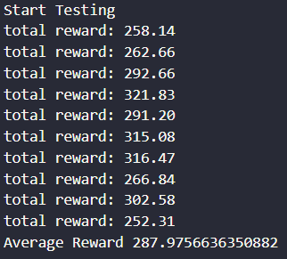
